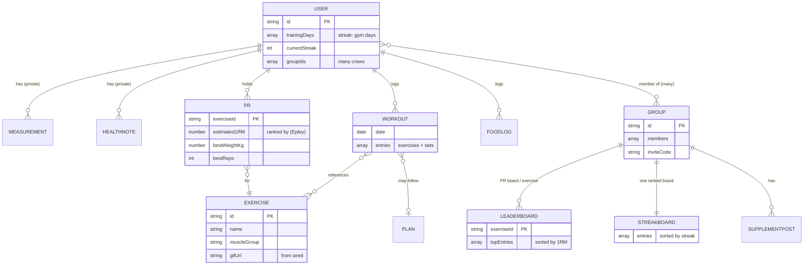

# IronSync — Data Model (Firebase / Cloud Firestore)

How IronSync's data is organized. **Firestore** is a NoSQL document database: **collections** hold **documents**, and documents can hold **sub-collections**. The TypeScript versions of everything here live in [`app/src/models/`](../app/src/models) — that's the code contract; this doc is the reasoning.

## 🗺️ The map


_🔒 measurements & health notes are owner-only, never group-visible. Boards are denormalized caches rebuilt by Cloud Functions on write._

## 🔑 Design decisions (locked)

These three shape the whole schema:

| Decision | Choice | What it means for the data |
| --- | --- | --- |
| **Streak** | Scheduled training days | User picks their gym days. Streak only cares about *those* days, so rest days don't break it. → needs `trainingDays` on the user. |
| **PR / "who's stronger"** | Estimated 1-rep-max (Epley) | We store an estimated 1RM per exercise so `100kg×5` and `110kg×2` compare fairly. → PR stores `estimated1RM` + the actual set. |
| **Groups** | Multiple per user | A user can be in several crews. → user has `groupIds: string[]`, and PR/streak updates fan out to *all* their groups. |

**Epley formula** (how we compute estimated 1RM): `1RM ≈ weight × (1 + reps / 30)`. For a single rep it's just the weight. This is the number we rank by and compare across the crew.

**Streak logic:** on a scheduled training day, if the user logs a workout, the streak survives/increments; if a scheduled day passes with no workout, the streak resets. Days *not* in `trainingDays` are ignored entirely.

---

## Core entities

### `users/{userId}`
The person's profile. `userId` comes from Firebase Auth.

```
users/{userId}
  displayName: string
  email: string
  age?: number
  gender?: string
  heightCm?: number
  goal?: "cut" | "maintain" | "bulk"
  createdAt: timestamp
  // streak (scheduled-days model)
  trainingDays: number[]        // weekdays 0=Sun..6=Sat, e.g. [1,3,5] = Mon/Wed/Fri
  currentStreak: number         // consecutive *scheduled* days trained
  longestStreak: number
  lastTrainedDate?: date        // YYYY-MM-DD of last logged workout
  // social — a user can belong to several crews
  groupIds: string[]
```

Private sub-collections under a user (🔒 owner-only — see [rules](../backend/firestore.rules)):

```
users/{userId}/measurements/{measurementId}
  date: date
  weightKg?: number
  bodyParts?: { chest, waist, arms, thighs, ... }   // optional map

users/{userId}/healthNotes/{noteId}
  note: string          // "left knee injury – avoid deep squats"
  createdAt: timestamp
```

> 🔒 Measurements & health notes are **sensitive personal data** and must NEVER be group-visible. Rules restrict them to the owner. See [ARCHITECTURE.md](ARCHITECTURE.md#privacy--sensitive-data).

### `exercises/{exerciseId}`
Shared exercise library (everyone reads; we seed it). Likely populated from ExerciseDB / free-exercise-db.

```
exercises/{exerciseId}
  name: string          // "Barbell Bench Press"
  muscleGroup: string   // "chest"
  equipment?: string    // "barbell"
  gifUrl?: string       // demo animation (from seed source)
  isCustom: boolean
  createdBy?: userId | null   // null = built-in/seeded
```

### `users/{userId}/workouts/{workoutId}`
A single workout session. This is the write that drives streaks and PRs.

```
users/{userId}/workouts/{workoutId}
  date: date
  planId?: string | null
  entries: [
    { exerciseId, sets: [ { reps, weightKg } ] },
    ...
  ]
  notes?: string
  createdAt: timestamp
```

### `users/{userId}/prs/{exerciseId}`
Personal record per exercise (one doc per exercise = O(1) lookups). Ranked by `estimated1RM`.

```
users/{userId}/prs/{exerciseId}
  exerciseId: string
  estimated1RM: number        // Epley — the value we compare/rank
  bestWeightKg: number        // the actual set that produced it
  bestReps: number
  achievedOn: date
  workoutId: string           // which session set it
```

### `plans/{planId}`
A training plan/template (e.g. Push/Pull/Legs).

```
plans/{planId}
  name: string
  createdBy?: userId | null    // null = built-in
  days: [
    { label: "Push", exercises: [ { exerciseId, targetSets, targetReps } ] },
    ...
  ]
```

---

## Social / friend group

### `groups/{groupId}`
A private crew. A user can be in several (their `groupIds` lists them; the group's `members` lists its people — kept in sync).

```
groups/{groupId}
  name: string
  members: [ userId, ... ]
  createdBy: userId
  createdAt: timestamp
  inviteCode?: string          // short code to join the crew
```

### `groups/{groupId}/leaderboard/{exerciseId}`
Denormalized PR board so the crew view loads in one read. Ranked by `estimated1RM`.

```
groups/{groupId}/leaderboard/{exerciseId}
  exerciseId: string
  topEntries: [
    { userId, displayName, estimated1RM, weightKg, reps, date },
    ...                        // sorted desc by estimated1RM
  ]
```

### `groups/{groupId}/streakBoard` (single doc)
Denormalized ranking of every member's current streak — one read draws the board.

```
groups/{groupId}/streakBoard
  updatedAt: timestamp
  entries: [
    { userId, displayName, currentStreak, longestStreak },
    ...                        // sort by currentStreak to rank
  ]
```

### `groups/{groupId}/supplementPosts/{postId}`
Supplement result sharing.

```
groups/{groupId}/supplementPosts/{postId}
  authorId: userId
  supplementName: string       // "Creatine Monohydrate"
  note: string                 // "week 4, strength clearly up"
  rating?: number              // optional 1–5
  createdAt: timestamp
```

---

## Nutrition (Phase 3)

```
users/{userId}/nutritionTargets (single doc)
  dailyCalories, proteinG, carbsG, fatG: number

users/{userId}/foodLog/{entryId}
  date: date
  name: string
  calories, proteinG, carbsG, fatG: number
  createdAt: timestamp
```

---

## The two write flows worth designing carefully

Both run **server-side in a Cloud Function** triggered when a workout is logged — never trust the client to update leaderboards.

### 1. Log workout → update streak
1. User logs a workout on some date.
2. Function checks: is this on/after the user's next scheduled training day? Update `currentStreak` (increment if the previous scheduled day was trained, else reset to 1), `longestStreak`, `lastTrainedDate`.
3. **For each group in `user.groupIds`**, update that group's `streakBoard` entry for this user.

### 2. Log workout → detect PR → "someone beat your PR"
1. Compute `estimated1RM` (Epley) for each exercise in the workout.
2. If it exceeds the user's stored PR for that exercise, overwrite `users/{uid}/prs/{exerciseId}`.
3. **For each group in `user.groupIds`:** read `groups/{gid}/leaderboard/{exerciseId}`. If the new 1RM beats the current #1 (and the holder isn't this user), send that person an **FCM push** ("🔥 Alex just beat your Bench Press PR!"). Rebuild the board's `topEntries`.

> ⚠️ **Multi-group cost:** because users can be in several crews, these updates fan out per group. Fine at our scale (a few small crews). If it ever grows, revisit.

---

## Indexes we'll likely need

Firestore needs a composite index for queries that filter+sort on different fields. Add these to [`backend/firestore.indexes.json`](../backend/firestore.indexes.json) when the query first errors (the error gives you a one-click link):

- `workouts` by `date` desc (workout history) — single-field, auto-indexed.
- `foodLog` by `date` (daily food view) — single-field, auto.
- `supplementPosts` by `createdAt` desc — single-field, auto.
- Leaderboards/streakBoard are pre-sorted arrays in one doc, so **no index needed** — that's the point of denormalizing them.

Most of our reads are direct doc lookups or single-field sorts, so we may need very few composite indexes. Good — that's by design.

---

## Denormalization strategy (why we duplicate some data)

Firestore charges per document read and can't JOIN, so we **duplicate small, stable fields** to avoid extra reads:

- `displayName` is copied onto leaderboard/streakBoard entries → draw a board without reading every member's profile. Cost: if someone renames themselves, a function refreshes the copies.
- PR/streak boards are **cached aggregates** rebuilt by Cloud Functions on write, so reads are cheap and the client never computes rankings.

Rule of thumb: **duplicate for read speed, and let a Cloud Function keep the copies honest on write.**

---

## Still open (smaller calls, not blocking)

- Rename propagation: when a user changes `displayName`, which cached copies do we refresh, and how eagerly?
- Group size cap / invite flow details (`inviteCode` generation & expiry).
- Custom exercises: live in the shared `exercises` collection with `isCustom:true`, or per-user? (Leaning shared with a flag.)
- Units: store everything in **kg + cm** internally, convert for display. (Recommended — one source of truth.)
